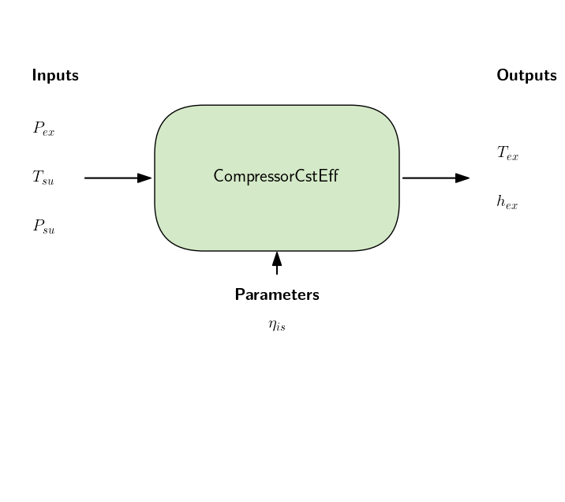

Constant Isentropic Efficiency
===============================

Model desciption
----------------

The constant isentropic efficiency model is a simple model based on the definition of the isentropic efficiency.

.. math::

   eta_is = \frac{h_{su} - h_{ex, is}}{h_{su} - h_{ex}}

